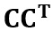

# Path Extrusion Tool for Blender (Version 3.5)
### Overview
To use this tool, select one polygon curve and another polygon path. The selected curve is extruded along the polygon path. This is achieved by extruding the loop towards each point on the path. The pivot of the curve is translated to the points on the path. The orientation is such that the normal vector of the best-fit plane of the curve is parallel to the path at all points on the path except the first point, for which the original orientation of the curve is used. When the path takes sharp turns, mitering is accomplished by scaling the loop in a manner dependent on the angle of the path.

### Technical Details
#### Definitions
The curve (the first polygon to be selected) consists of connected points. For the purposes of the following discussion, the points are considered 3-dimensional column vectors. The points and pivots are named as shown below, as an example.

The path also consists of connected points, named below as an example. The path must consist of vertices that have no more than 2 edges connected to them, in order to avoid ambiguity in the direction and order of extrusion.

The curve matrix is defined as the matrix where each point on the curve is a column.

#### Translation
The translation vectors define how the curve is translated along the path. First the pivot point is translated to the location of the first point in the curve. Thus the first translation vector is . For all subsequent translations, the vector is simply the difference between the next point on the path and the point immediately before it .

#### Rotation

First, the initial normal vector for the curve is determined by finding the normal vector of the plane that best fits all the points on the curve. This is accomplished by first finding the eigenvalues and eigenvectors of the matrix .

The eigenvectors are shown in green in the image above. The eigenvector corresponding to the eigenvalue with the smallest absolute value is the normal vector .

All subsequent normal vectors are calculated as follows

This corresponds to the average of the normalized directions of lines that connect to the vertex of interest.

The rotation angle is calculated as

The rotation axis is defined as

Which is the vector perpendicular to the initial and final normal vectors.

#### Scaling
In addition to translation and rotation, scaling is performed during the extrusion process to prevent pinching of the resulting surface at sharp corners. The result is mitered corners.

The angle of the corner is calculated as

And the scaling factor, (corner width relative to the edge width), is

For each step in the extrusion process, the scaling applied is the ratio of the scaling factor at the point of interest, over the scaling factor at the previous point.

### Version 2.0 Updates
1. Added support for closed extrusion paths
2. Changed behavior to scale the first edge loop to preserve the scale of the normal cross section, and inverting the sign if necessary to prevent flipping of the extruded curve.
3. Fixed an incorrect vector reference in the orientation matrix calculation, which previously led to scaling along the incorrect axis (most noticeable with acute angles in the extrusion path).

### Version 3.0 Updates
1. Added support for Blender 2.9

### Version 3.1 Updates
1. Limit orientation matrix correction to Blender 2.90, since the issues were resolved in Blender 2.91
2. For meshes extruded along closed paths, removed faces prior to extrusion, in order to prevent creation of interior faces in the final object.
3. Corrected indexing error that occurred when negative eigenvalues were encountered.

### Version 3.2 Updates
1. Fixed rotation behavior for curved paths in Blender 2.90
2. Added the ability to use extrusion paths whose vertices are not in order.

### Version 3.3 Updates
1. Duplicate vertex removal in the extrusion path now only occurs if the vertices are adjacent in the path
2. Added handling for division by 0 errors

### Version 3.4 Updates
1. Fixed rotation behavior in Blender 2.92

### Version 3.5 Updates
1. Added support for Blender 3.0
